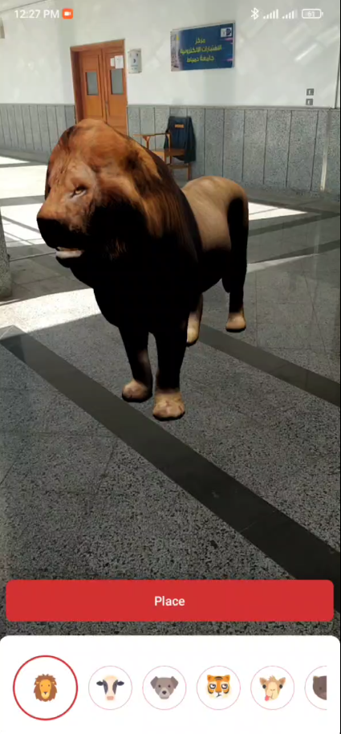
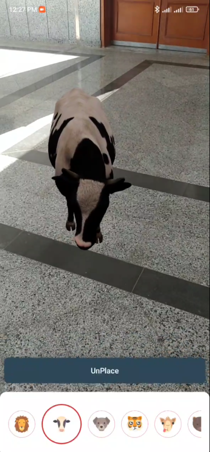
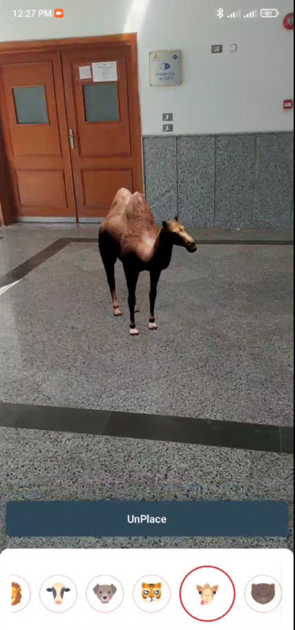
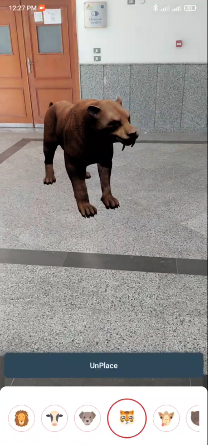

# AR Playground

AR Playground is an augmented reality app that view 3D objects in the surrounding.

Available on MediaFire Store and soon also on Google Play.

## Screenshots

   
   
   
    
    

## Preview

### 🧑🏻‍💻 Android development

- Application is entirely written in [Kotlin](https://kotlinlang.org)
- Complete migrated to [Jetpack Compose](https://developer.android.com/jetpack/compose)
- Following the [Material You](https://m3.material.io/) guidelines and dynamic color
- Asynchronous processing using [Coroutines](https://kotlin.github.io/kotlinx.coroutines/)
- 3D objects view using [AR Scene](https://github.com/SceneView/sceneview-android)
- AR Check avilabilty using [AR Core](https://developers.google.com/ar)

### Features ✨

- Model the 3D objects in the surrounding
- Ability to change the model place
- Ancore the model in spacific place and detach ancore
- Resize the model by guestures
- Rotate the model by 360 degrees
- Change between 6 animals models

## How to change models?

- Get your desired model.glb file
- Place it in the assets folder
- Open MainViewModel Class
- find the function called getModelsList
- Make your model item and add it to the list returned by this function

## Find this repository useful? :heart:
Support it by putting a star for this repository. :star:  
Also, __[follow me](https://github.com/3wiida)__ on GitHub for my next creations! 🤩
